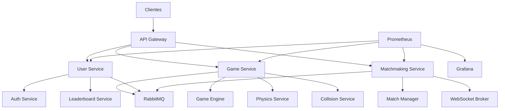
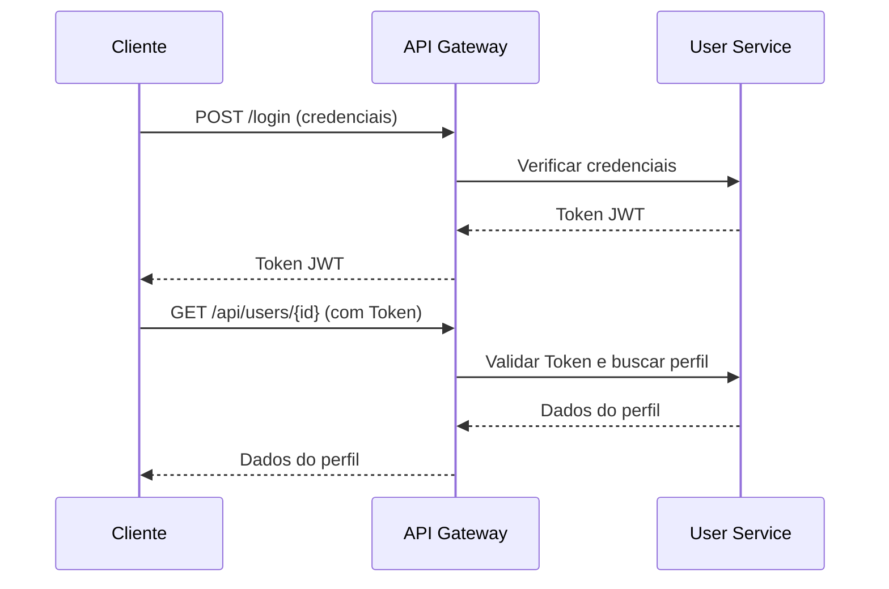
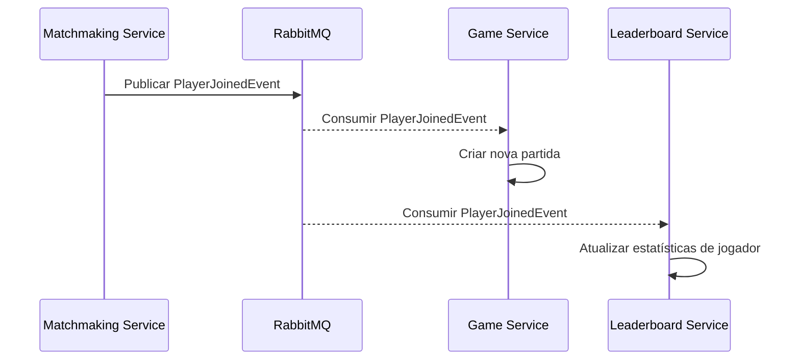
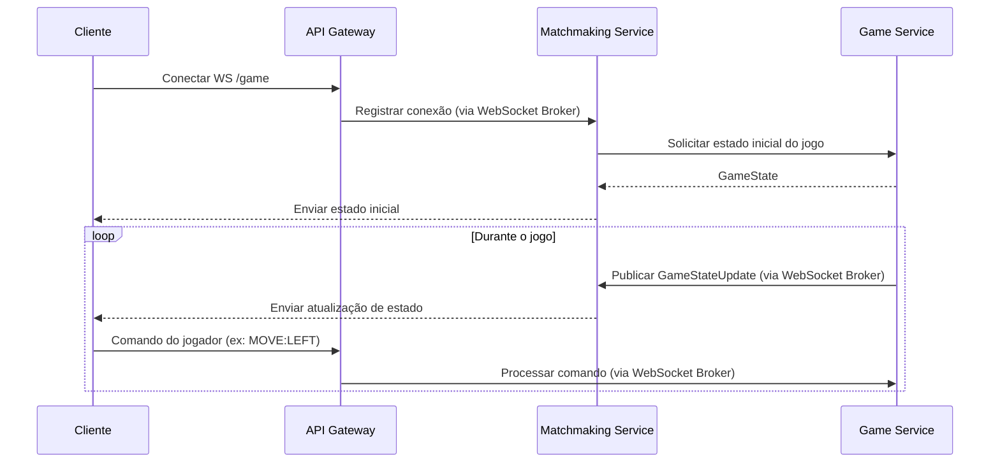

# Fase 2: Planejamento da Arquitetura e Decisões de Design

Nesta fase, detalharemos as decisões arquiteturais e de design que fundamentam a reconstrução do Slither.io como um sistema de microsserviços em Kotlin. Cada escolha foi ponderada para atender aos requisitos de escalabilidade, resiliência, manutenibilidade e performance, alinhando-se às melhores práticas do mercado e às expectativas de um ambiente como o C6 Bank.

## 2.1 Arquitetura Geral do Sistema: Microsserviços

A arquitetura adotada para o Slither.io é baseada em microsserviços. Essa escolha não é arbitrária, mas sim uma resposta direta aos desafios inerentes a um jogo online com potencial de alta concorrência e a necessidade de um desenvolvimento ágil e escalável. Um sistema monolítico, embora mais simples de iniciar, rapidamente se tornaria um gargalo em termos de complexidade, deploy e escalabilidade em um cenário de crescimento.

### Justificativa para Microsserviços:

*   **Escalabilidade Independente:** Cada serviço pode ser escalado horizontalmente de forma independente, de acordo com sua demanda específica. Por exemplo, o `Game Service` pode precisar de mais instâncias durante picos de jogadores, enquanto o `User Service` pode ter uma demanda mais estável. Isso otimiza o uso de recursos e reduz custos operacionais.
*   **Resiliência Aprimorada:** A falha em um microsserviço não necessariamente derruba todo o sistema. Com padrões como Circuit Breaker e Retry, é possível isolar falhas e permitir que o sistema continue operando, mesmo que com funcionalidades degradadas. Isso é crucial para a experiência do usuário em um jogo online.
*   **Desenvolvimento Ágil e Independente:** Equipes menores podem trabalhar em microsserviços específicos de forma autônoma, utilizando as tecnologias mais adequadas para cada domínio. Isso acelera o ciclo de desenvolvimento, facilita a integração contínua e o deploy contínuo (CI/CD).
*   **Manutenibilidade e Compreensão:** Serviços menores e com responsabilidades bem definidas são mais fáceis de entender, manter e depurar. A base de código é menor e mais focada, reduzindo a complexidade cognitiva para os desenvolvedores.
*   **Flexibilidade Tecnológica:** Permite a utilização de diferentes tecnologias (linguagens, frameworks, bancos de dados) para cada serviço, caso seja necessário. Embora este projeto utilize Kotlin e Spring Boot predominantemente, a arquitetura de microsserviços não impõe uma pilha tecnológica única.

### Diagrama de Arquitetura Geral:

O diagrama a seguir ilustra a visão de alto nível da arquitetura de microsserviços, mostrando a interação entre os principais componentes:



Este diagrama será detalhado nas próximas seções, explicando a responsabilidade de cada serviço e como eles interagem para formar o sistema completo do Slither.io.


## 2.2 Divisão de Responsabilidades dos Microsserviços

Cada microsserviço na arquitetura do Slither.io foi projetado com uma responsabilidade única e bem definida, seguindo o princípio de Alta Coesão (GRASP High Cohesion). Essa abordagem minimiza o acoplamento entre os serviços (GRASP Low Coupling), facilitando a manutenção, o teste e a evolução independente de cada componente.

A tabela a seguir detalha a finalidade e as principais tecnologias associadas a cada serviço:

| Serviço | Tecnologias Principais | Responsabilidade |
|---|---|---|
| **API Gateway** | Spring Cloud Gateway, Kotlin Corrotinas | Ponto de entrada unificado para todas as requisições dos clientes. Responsável por roteamento, balanceamento de carga, autenticação (pré-processamento) e agregação de requisições. Atua como um ponto de indireção (GRASP Indirection) entre os clientes e os serviços internos. |
| **User Service** | Spring Security, JWT, PostgreSQL | Gerencia o ciclo de vida dos usuários, incluindo registro, autenticação, perfis e dados de conta. Interage com o `Auth Service` para autenticação e com o `Leaderboard Service` para dados de ranking. |
| **Auth Service** | Spring Security, JWT | Responsável pela lógica de autenticação e autorização, emissão e validação de tokens JWT. Garante que apenas usuários autenticados e autorizados acessem os recursos protegidos. |
| **Leaderboard Service** | PostgreSQL | Armazena e gerencia os rankings dos jogadores, incluindo pontuações e estatísticas. Fornece APIs para consulta e atualização do ranking. |
| **Matchmaking Service** | WebSockets, STOMP, Redis | Gerencia a lógica de formação de partidas entre jogadores. Responsável por receber solicitações de partida, encontrar jogadores compatíveis e iniciar novas sessões de jogo. Utiliza WebSockets para comunicação em tempo real com os clientes e Redis para gerenciar o estado das partidas e jogadores aguardando. |
| **Game Service** | Spring Boot, R2DBC, Kotlin Corrotinas | Contém a lógica central do jogo. Gerencia o estado das partidas, a interação entre jogadores e o ambiente do jogo. Orquestra o `Game Engine`, `Physics Service` e `Collision Service`. É o coração do jogo, onde a simulação acontece. |
| **Game Engine** | Kotlin Corrotinas | Componente interno do `Game Service` responsável por executar o loop principal do jogo, atualizando o estado do jogo em intervalos regulares (ticks). Coordena as atualizações de física e detecção de colisão. |
| **Physics Service** | Kotlin Corrotinas | Componente interno do `Game Service` responsável por calcular a movimentação dos jogadores e outros objetos no ambiente do jogo, aplicando as leis da física do jogo. Implementa o padrão Strategy para diferentes comportamentos físicos. |
| **Collision Service** | Kotlin Corrotinas | Componente interno do `Game Service` responsável por detectar colisões entre jogadores, comida e obstáculos no ambiente do jogo. Notifica o `Game Service` sobre eventos de colisão. |
| **Message Broker** | RabbitMQ | Atua como um barramento de comunicação assíncrona entre os microsserviços. Utilizado para eventos de jogo (e.g., `PlayerJoined`, `GameStateUpdate`) e outras comunicações que não exigem resposta imediata. Garante a entrega de mensagens e desacopla os serviços. |
| **Prometheus** | Go | Sistema de monitoramento e alerta de código aberto. Coleta métricas de todos os microsserviços para observabilidade. |
| **Grafana** | Go | Plataforma de visualização de dados. Utilizada para criar dashboards interativos que exibem as métricas coletadas pelo Prometheus, permitindo o monitoramento em tempo real da saúde e performance do sistema. |

Essa divisão de responsabilidades permite que cada serviço seja desenvolvido, testado e implantado de forma independente, promovendo a agilidade e a robustez do sistema como um todo.


## 2.3 Padrões de Comunicação entre Serviços

A comunicação eficaz entre os microsserviços é fundamental para o funcionamento do sistema. No Slither.io, foram empregados diferentes padrões de comunicação, cada um escolhido para otimizar a interação de acordo com a necessidade específica de cada fluxo de dados.

### 2.3.1 Comunicação Síncrona (Requisição/Resposta)

Para interações que exigem uma resposta imediata, como autenticação de usuário ou consulta de dados de perfil, a comunicação síncrona via REST (Representational State Transfer) é utilizada. O `API Gateway` atua como um proxy reverso, roteando as requisições dos clientes para o serviço apropriado.



**Decisões de Design:**

*   **RESTful APIs:** Amplamente adotadas na indústria, fornecem uma interface padronizada e sem estado para a comunicação. A simplicidade e a ubiquidade do HTTP tornam a integração entre diferentes serviços e clientes mais fácil.
*   **JSON como Formato de Dados:** Leve, legível por humanos e facilmente parseável por máquinas, é o formato padrão para troca de dados nas APIs RESTful.
*   **API Gateway:** Centraliza o ponto de entrada, abstraindo a complexidade da topologia dos microsserviços dos clientes. Permite a aplicação de políticas de segurança, rate limiting e transformação de requisições em um único ponto.

### 2.3.2 Comunicação Assíncrona (Baseada em Eventos)

Para cenários onde a resposta imediata não é necessária ou onde múltiplos serviços precisam reagir a um mesmo evento, a comunicação assíncrona baseada em eventos é a escolha ideal. O `RabbitMQ` atua como um Message Broker, garantindo a entrega de mensagens e desacoplando os produtores dos consumidores.



**Decisões de Design:**

*   **RabbitMQ:** Escolhido por sua robustez, flexibilidade e suporte a diversos padrões de mensageria (queues, topics, exchanges). É amplamente utilizado em arquiteturas de microsserviços para garantir a comunicação confiável e escalável.
*   **Event-Driven Architecture:** Promove o baixo acoplamento, pois os serviços não precisam conhecer uns aos outros diretamente. Um serviço publica um evento, e qualquer outro serviço interessado pode consumi-lo e reagir a ele. Isso aumenta a resiliência e a escalabilidade do sistema.
*   **Idempotência:** É crucial que os consumidores de eventos sejam idempotentes, ou seja, que processar o mesmo evento múltiplas vezes não cause efeitos colaterais indesejados. Isso é importante para lidar com falhas e reentregas de mensagens.

### 2.3.3 Comunicação em Tempo Real (WebSockets)

Para a experiência de jogo interativa, onde atualizações de estado e comandos dos jogadores precisam ser transmitidos com baixa latência, a comunicação via WebSockets é indispensável.



**Decisões de Design:**

*   **WebSockets:** Oferecem uma conexão persistente e full-duplex entre cliente e servidor, ideal para aplicações que exigem comunicação em tempo real e baixa latência, como jogos online. Reduz a sobrecarga de HTTP e permite push de informações do servidor para o cliente.
*   **STOMP (Simple Text Oriented Messaging Protocol):** Utilizado sobre WebSockets para fornecer um protocolo de mensagens estruturado, facilitando a troca de mensagens entre clientes e servidores. Simplifica a implementação de publish/subscribe e roteamento de mensagens.
*   **WebSocket Broker (no Matchmaking Service):** Atua como um intermediário para gerenciar as conexões WebSocket e rotear mensagens entre os clientes e o `Game Service`. Isso permite que o `Game Service` se concentre na lógica do jogo, enquanto o `Matchmaking Service` lida com a complexidade das conexões em tempo real.

A combinação desses padrões de comunicação permite que o sistema Slither.io atenda a diversas necessidades de interação, desde transações síncronas até atualizações de jogo em tempo real, garantindo a performance e a escalabilidade necessárias.


## 2.4 Decisões de Design para o Modelo de Domínio do Jogo

O modelo de domínio é a representação central da lógica de negócios do jogo. No Slither.io, a modelagem foi feita com foco em clareza, coesão e encapsulamento, utilizando as capacidades da linguagem Kotlin para criar entidades expressivas e eficientes.

### Entidades Principais:

*   **`GameState`**: Representa o estado atual de uma partida específica do jogo. Contém informações globais como o ID do jogo, os jogadores ativos, os itens de comida e os obstáculos. A escolha de um `Map<UUID, Player>` para jogadores permite acesso rápido por ID, essencial em um ambiente de jogo dinâmico.

    ```kotlin
    data class GameState(
        val gameId: UUID,
        val players: Map<UUID, Player>,
        val foodItems: List<Food>,
        val obstacles: List<Obstacle>,
        val status: GameStatus = GameStatus.WAITING
    )
    ```

*   **`Player`**: Representa um jogador individual no jogo. Inclui o ID do jogador, nome, a instância da `Snake` associada, pontuação e status de vida. A inclusão da `Snake` como parte do `Player` demonstra uma relação de composição, onde o jogador 'possui' uma cobra.

    ```kotlin
    data class Player(
        val playerId: UUID,
        val name: String,
        val snake: Snake,
        var score: Int = 0,
        var isAlive: Boolean = true
    ) {
        // Padrão Strategy para movimento
        fun updatePosition(strategy: MovementStrategy, deltaTime: Double) {
            strategy.calculateNewPosition(this, deltaTime)
        }
    }
    ```

*   **`Snake`**: Representa a cobra controlada pelo jogador. É uma entidade crucial que encapsula a lógica de movimento e o estado do corpo da cobra. A utilização de um `Deque<Point>` para os segmentos da cobra permite operações eficientes de adição e remoção nas extremidades, simulando o movimento da cobra (adicionar nova cabeça, remover última cauda).

    ```kotlin
    data class Snake(
        val segments: Deque<Point>,
        var direction: Direction,
        val color: String,
        val speed: Double = 5.0
    ) {
        // GRASP Information Expert
        fun move() {
            val head = segments.first
            val newHead = calculateNewHead(head, direction)
            segments.addFirst(newHead)
            segments.removeLast()
        }
        
        private fun calculateNewHead(currentHead: Point, direction: Direction): Point {
            return when (direction) {
                Direction.UP -> Point(currentHead.x, currentHead.y - speed)
                Direction.DOWN -> Point(currentHead.x, currentHead.y + speed)
                Direction.LEFT -> Point(currentHead.x - speed, currentHead.y)
                Direction.RIGHT -> Point(currentHead.x + speed, currentHead.y)
            }
        }
    }
    ```

**Decisões de Design e Padrões Aplicados:**

*   **GRASP High Cohesion (Alta Coesão):** A entidade `Snake` é um excelente exemplo. Ela é responsável por gerenciar seu próprio estado (segmentos, direção, cor, velocidade) e sua própria lógica de movimento (`move()` e `calculateNewHead()`). Isso significa que todas as responsabilidades relacionadas à cobra estão encapsuladas dentro da própria classe `Snake`, tornando-a mais compreensível, reutilizável e menos suscetível a mudanças externas.

*   **GRASP Information Expert (Especialista da Informação):** O método `move()` dentro da classe `Snake` é um exemplo direto deste padrão. A `Snake` é a classe que possui todas as informações necessárias (seus segmentos, direção, velocidade) para calcular seu próprio movimento. Atribuir essa responsabilidade à `Snake` garante que a lógica esteja próxima dos dados que ela manipula, resultando em um design mais intuitivo e com baixo acoplamento.

*   **Padrão Strategy (para `Player.updatePosition`):** Embora o exemplo inicial da `Snake` mostre um movimento direto, a inclusão de `updatePosition(strategy: MovementStrategy, deltaTime: Double)` no `Player` sugere a aplicação do padrão Strategy. Isso permite que diferentes algoritmos de movimento (e.g., movimento normal, movimento acelerado, movimento de IA) sejam aplicados ao jogador de forma intercambiável, sem modificar a classe `Player` em si. Isso aumenta a flexibilidade e a extensibilidade do sistema de física do jogo.

*   **Imutabilidade (Data Classes):** O uso de `data class` em Kotlin para `GameState`, `Player` e `Snake` promove a imutabilidade por padrão para as propriedades declaradas com `val`. Embora `Player` tenha `var score` e `var isAlive`, a estrutura geral favorece a imutabilidade, o que simplifica o raciocínio sobre o estado do jogo, especialmente em um ambiente concorrente. A imutabilidade ajuda a prevenir efeitos colaterais indesejados e facilita a depuração.

*   **Encapsulamento:** Os detalhes internos de como a cobra se move ou como o estado do jogo é gerenciado são encapsulados dentro de suas respectivas classes, expondo apenas as interfaces necessárias para interação. Isso protege a integridade dos dados e permite que as implementações internas mudem sem afetar o restante do sistema.

Essas decisões de design para o modelo de domínio são cruciais para construir um jogo robusto e de fácil manutenção, onde a lógica de negócios é clara e as responsabilidades são bem distribuídas.


## 2.5 Escolha de Kotlin e Spring Boot

A seleção de Kotlin como linguagem de programação principal e Spring Boot como framework para o desenvolvimento dos microsserviços não foi aleatória. Ambas as tecnologias oferecem vantagens significativas que se alinham perfeitamente aos requisitos de um projeto moderno, escalável e de alta performance, como o Slither.io, e às expectativas de um ambiente de desenvolvimento ágil como o do C6 Bank.

### 2.5.1 Kotlin: A Linguagem da Produtividade e Concorrência

Kotlin é uma linguagem de programação moderna, estaticamente tipada, que roda na Java Virtual Machine (JVM) e é totalmente interoperável com Java. Suas principais vantagens incluem:

*   **Concisão e Expressividade:** Kotlin permite escrever código mais limpo e conciso em comparação com Java, reduzindo a verbosidade e aumentando a legibilidade. Isso se traduz em maior produtividade para os desenvolvedores e menor chance de erros.
*   **Segurança de Nulos (Null Safety):** Kotlin possui um sistema de tipos que elimina o temido `NullPointerException` em tempo de compilação, forçando o desenvolvedor a lidar explicitamente com valores nulos. Isso aumenta a robustez e a confiabilidade do código.
*   **Corrotinas (Coroutines):** Esta é uma das características mais poderosas de Kotlin para o desenvolvimento de aplicações concorrentes e reativas. As corrotinas oferecem uma maneira leve e eficiente de escrever código assíncrono e não bloqueante, ideal para lidar com a alta concorrência esperada em um jogo online. Diferente das threads tradicionais, as corrotinas são mais baratas em termos de recursos e mais fáceis de gerenciar, permitindo a criação de milhares de operações concorrentes sem sobrecarregar o sistema. No contexto do `GameEngine` e dos serviços de física/colisão, as corrotinas são essenciais para processar múltiplos jogadores e eventos de jogo simultaneamente com alta performance.
*   **Interoperabilidade com Java:** A capacidade de usar bibliotecas e frameworks Java existentes sem problemas é um grande benefício, permitindo que o projeto aproveite o vasto ecossistema Java enquanto adota uma linguagem mais moderna e produtiva.

### 2.5.2 Spring Boot: Agilidade e Ecossistema Completo

Spring Boot é um framework que simplifica drasticamente o desenvolvimento de aplicações baseadas em Spring, especialmente microsserviços. Suas vantagens incluem:

*   **Desenvolvimento Rápido:** Com o Spring Boot, é possível criar aplicações Spring autônomas e prontas para produção com o mínimo de configuração. Ele adota uma abordagem de "convenção sobre configuração", fornecendo starters que automaticamente configuram as dependências e o ambiente para casos de uso comuns (e.g., `spring-boot-starter-webflux` para aplicações reativas, `spring-boot-starter-websocket` para comunicação em tempo real).
*   **Ecossistema Abrangente:** O Spring oferece um ecossistema maduro e vasto de projetos (Spring Cloud, Spring Security, Spring Data, etc.) que fornecem soluções prontas para os desafios comuns em arquiteturas de microsserviços, como descoberta de serviços, balanceamento de carga, tolerância a falhas (Resilience4j), segurança e integração com bancos de dados reativos (R2DBC).
*   **Suporte a Programação Reativa (WebFlux):** O Spring Boot, em conjunto com o Spring WebFlux, oferece um modelo de programação reativa não bloqueante, que é fundamental para construir sistemas de alta performance e escalabilidade, especialmente em cenários de I/O intensiva como um jogo online. Isso complementa perfeitamente as corrotinas de Kotlin.
*   **Testabilidade:** O Spring Boot facilita a escrita de testes unitários e de integração, com suporte a ferramentas como JUnit e Testcontainers, garantindo a qualidade e a confiabilidade do código.

Em resumo, a combinação de Kotlin e Spring Boot oferece uma poderosa sinergia: Kotlin proporciona uma linguagem moderna e eficiente para lidar com concorrência, enquanto Spring Boot fornece um framework robusto e um ecossistema completo para construir e gerenciar microsserviços de forma ágil e escalável. Essa escolha tecnológica é um pilar fundamental para a construção de um Slither.io resiliente e de alta performance.


## 2.6 Estrutura do Monorepo

Para gerenciar os múltiplos microsserviços e bibliotecas compartilhadas de forma eficiente, o projeto Slither.io adota uma estrutura de monorepo. Um monorepo (repositório monolítico) é um único repositório de código que contém o código-fonte de vários projetos, em vez de ter um repositório separado para cada um. Essa abordagem, embora com seus próprios desafios, oferece benefícios significativos para o desenvolvimento e a manutenção de uma arquitetura de microsserviços.

### Estrutura de Diretórios:

A estrutura de diretórios do monorepo é organizada da seguinte forma:

```
slither-kotlin/
├── api-gateway/
├── game-service/
├── user-service/
├── matchmaking-service/
├── common-lib/
├── docker-compose.yml
└── kubernetes/
```

**Explicação dos Componentes:**

*   **`slither-kotlin/`**: O diretório raiz do monorepo, contendo todos os projetos e configurações globais.

*   **`api-gateway/`**: Contém o código-fonte do microsserviço API Gateway. Este serviço é responsável por rotear as requisições dos clientes para os serviços internos, atuando como o ponto de entrada unificado para a aplicação.

*   **`game-service/`**: Contém o código-fonte do microsserviço Game Service. Este é o coração do jogo, responsável pela lógica central, simulação de partidas, física e detecção de colisões.

*   **`user-service/`**: Contém o código-fonte do microsserviço User Service. Gerencia o ciclo de vida dos usuários, incluindo autenticação, registro e perfis.

*   **`matchmaking-service/`**: Contém o código-fonte do microsserviço Matchmaking Service. Responsável por gerenciar a formação de partidas e a comunicação em tempo real via WebSockets.

*   **`common-lib/`**: Uma biblioteca compartilhada que contém classes, interfaces e utilitários que são utilizados por múltiplos microsserviços. Isso inclui modelos de domínio compartilhados, constantes, exceções comuns e outras lógicas que precisam ser reutilizadas. A existência de uma `common-lib` é crucial em um monorepo para evitar duplicação de código e garantir consistência entre os serviços.

*   **`docker-compose.yml`**: Um arquivo de configuração Docker Compose que define e orquestra os serviços Docker para o ambiente de desenvolvimento local. Permite que os desenvolvedores iniciem e gerenciem todos os microsserviços e suas dependências (como RabbitMQ, PostgreSQL, Prometheus) com um único comando, facilitando o desenvolvimento e o teste local.

*   **`kubernetes/`**: Contém os arquivos de configuração do Kubernetes (manifestos YAML) para o deploy dos microsserviços em um cluster Kubernetes. Isso inclui definições para Deployments, Services, Ingress, ConfigMaps, Secrets, etc., permitindo a orquestração e o gerenciamento dos serviços em produção.

### Vantagens da Estrutura de Monorepo:

*   **Reuso de Código Simplificado:** A `common-lib` facilita o compartilhamento de código entre os microsserviços, garantindo consistência e reduzindo a duplicação. Isso é particularmente útil para modelos de domínio, contratos de API e utilitários.
*   **Refatoração Atômica:** Alterações que afetam múltiplos serviços (e.g., uma mudança em um modelo de dados compartilhado) podem ser feitas em uma única transação de commit, garantindo que todos os serviços sejam atualizados simultaneamente e permaneçam compatíveis. Isso simplifica a gestão de dependências e a coordenação entre equipes.
*   **Visibilidade e Descoberta:** Todos os projetos estão no mesmo lugar, o que facilita a compreensão da arquitetura geral do sistema e a descoberta de como os diferentes serviços interagem.
*   **CI/CD Simplificado:** Embora possa ser mais complexo de configurar inicialmente, um pipeline de CI/CD para um monorepo pode ser otimizado para construir e testar apenas os serviços que foram alterados, economizando tempo e recursos.
*   **Gerenciamento de Dependências Centralizado:** Ferramentas de build como Gradle (com `build.gradle.kts` no diretório raiz e subprojetos) podem gerenciar as dependências de todos os serviços de forma centralizada, garantindo que as versões das bibliotecas sejam consistentes.

### Desafios do Monorepo (e como são mitigados):

*   **Tamanho do Repositório:** Monorepos podem se tornar muito grandes ao longo do tempo, o que pode impactar o desempenho de operações Git. Isso é mitigado com boas práticas de Git e ferramentas de build que suportam builds incrementais.
*   **Complexidade do Build:** O sistema de build pode se tornar complexo para gerenciar múltiplos projetos. O uso de Gradle com sua capacidade de gerenciar subprojetos ajuda a organizar e otimizar o processo de build.
*   **CI/CD:** Configurar pipelines de CI/CD que sejam eficientes para um monorepo (construindo apenas o que mudou) exige ferramentas e estratégias específicas, como as que serão detalhadas na seção de CI/CD.

A escolha do monorepo para o projeto Slither.io reflete a intenção de otimizar o desenvolvimento e a manutenção de uma arquitetura de microsserviços, promovendo a colaboração e a consistência entre os diferentes componentes do sistema.

